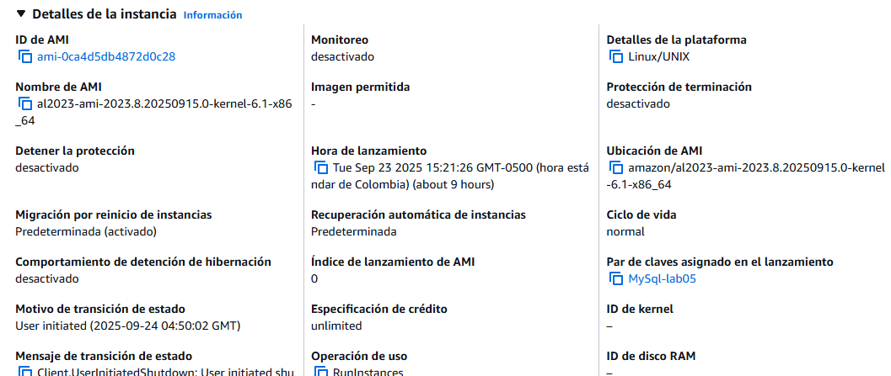

# Property Manager AREP-T5


## Resumen del proyecto
Sistema CRUD para gestionar propiedades inmobiliarias.  
Permite crear, listar, actualizar y eliminar anuncios de propiedades (**address, price, size, description**).  

Arquitectura basada en microservicios/contenerización:  
- **Backend** (Spring Boot REST API) y **base de datos MySQL** corren en contenedores Docker **en instancias separadas de AWS**.  
- **Frontend** (HTML + JS) corre en un contenedor Docker **local** durante desarrollo.

---

# Arquitectura del sistema

La solución se compone de tres capas principales: **Frontend**, **Backend** y **Base de datos**, cada una desplegada en entornos separados y comunicándose a través de servicios REST.

---

##  Frontend (contenedor local en Docker)
- Construido con **HTML + JavaScript**.  
- Ofrece formularios para capturar información de propiedades, validaciones básicas en el cliente y llamadas `fetch()` hacia la API REST.  
- Se ejecuta en un contenedor **Docker local**, pero todas las solicitudes se redirigen al backend desplegado en **AWS**.  

---

##  Backend (contenedor Docker en AWS)
- Implementado en **Spring Boot**.  
- Expone endpoints **RESTful** para operaciones **CRUD** (crear, leer, actualizar, eliminar).  
- Gestiona la conversión **JSON ⇄ POJO** y utiliza **JPA/Hibernate** para la persistencia en la base de datos.  
- Está desplegado en una **instancia EC2 independiente**, conectándose con la base de datos a través de la **red privada de AWS**.  

---

##  Base de datos (contenedor MySQL en AWS)
- Implementada en un contenedor **MySQL** desplegado en una **instancia EC2 separada**.  
- Almacena los datos en dos tablas principales:
  - **users**: información de los usuarios.  
  - **properties**: registros de propiedades con dirección, precio, tamaño y descripción.  
- Solo es accesible desde el backend mediante la **red privada de AWS** (no expuesta públicamente).  

---

##  Flujo de comunicación
1. El usuario interactúa con el **frontend** desde su máquina local.  
2. El frontend envía solicitudes **HTTP(S)** al **backend** desplegado en AWS.  
3. El backend procesa la lógica de negocio y consulta/actualiza datos en la **base de datos MySQL**.  


---

## Diseño de clases (visión general)

#### modelo
- **`user` (Entidad / POJO)**  
  - `UUID id` (autogenerado)  
  - `String username`  
  - `Double email`  
  - `List<Property> properties`
  - 
- **`Property` (Entidad / POJO)**  
  - `UUID id` (autogenerado)  
  - `String address`  
  - `Double price`  
  - `Double size`  
  - `String description`
 
  #### repositorios
- **`UserRepository` (JPA Repository / DAO)**  
  - `save()`, `findById()`, `findAll()`, `deleteById()`

- **`PropertyRepository` (JPA Repository / DAO)**  
  - `save()`, `findById()`, `findAll()`, `deleteById()`

#### servicios
- **`UserService`**  
  - `addUser()`, `findAll()`, `findUserById()`, `updateUser()`,`deleteUserById()`,`getPropertyById()`, `addProperty()`
  - 
- **`PropertyService`**  
  - `addProperty()`, `updateProperty()`,`deleteProperty()`,`getProperty()`

#### controladores
- **`UserController` (REST Controller)**  
  - Endpoints CRUD:
    - `POST /User/add` → crear
    - `GET /User/allUsers` → listar
    - `GET /User/{id}` → obtener por id
    - `GET /User/{id}/product` → obtener por las propiedades del usuario
    - `PUT /User/update/{id}` → actualizar
    - `DELETE /User/delete/{id}` → eliminar

- **`PropertyController` (REST Controller)**  
  - Endpoints CRUD:
    - `POST /property/add` → crear
    - `GET /property/allProperties` → listar
    - `GET /property/{id}` → obtener por id
    - `PUT /property/update/{id}` → actualizar
    - `DELETE /property/delete/{id}` → eliminar


  

---


## Configuración inicial
1. Instalar **Docker** y **Docker Compose** en tu máquina local.  
2. Verificar acceso a tu cuenta de **Docker Hub** y **AWS** (credenciales configuradas).  
3. Clonar el repositorio del proyecto:  
   ```bash
   git clone https://github.com/XxELIngexX/AREP-T5.git
   #para acceder al front
   cd AREP-T5/propertyManager-front

   #para acceder al back
   cd AREP-T5/propertyManager

## Generar imagenes Docker
### Base de Datos

Para la capa de persistencia utilizamos la imagen oficial de **MySQL 8.1** disponible en Docker Hub.  
No es necesario construir una imagen personalizada, ya que la oficial ya incluye todas las configuraciones necesarias para correr un servidor MySQL productivo.  


1. Crear una instancia EC2 dedicada
  Es recomendable que la base de datos tenga su propia instancia para:
    - Separar la lógica de negocio (backend) de la persistencia de datos.
    - Mejorar la seguridad (solo el backend puede acceder a la DB).
    - Evitar que fallos en el backend impacten directamente en la base de datos.
  
    Selecciona una AMI de **Amazon Linux 2** o similar, con al menos **1 vCPU y 1GB RAM**.  
    Asegúrate de configurar correctamente el **Security Group** para permitir acceso al puerto **3306** únicamente desde la instancia del backend.

  

2. Instalar Docker en la instancia MySql
   
    Una vez creada la instancia, conecta por **SSH** y ejecuta los siguientes comandos:
    
    ```bash
    # Actualizar los paquetes
    sudo yum update -y
    
    # Habilitar el repositorio de Docker
    sudo amazon-linux-extras enable docker
    
    # Instalar Docker
    sudo yum install docker -y
    
    # Iniciar el servicio Docker
    sudo service docker start 
    ```
  3. Obtener la imagen oficial de MySQL 
  
      Con Docker funcionando, descargamos la imagen oficial:

      ```
      docker pull mysql:8.1
      ```
      Esto trae desde Docker Hub la versión estable 8.1 de MySQL.

4. Ejecutar el contenedor de MySQL

Ejecutamos un contenedor configurado con las variables de entorno necesarias:
`MYSQL_ROOT_PASSWORD` → contraseña del usuario root.

`MYSQL_DATABASE` → base de datos inicial creada automáticamente.

`-p 3306:3306` → expone el puerto 3306 para que el backend pueda conectarse.
```
docker run -d --name mysql-server -e MYSQL_ROOT_PASSWORD=admin1234 -e MYSQL_DATABASE=lab05db -e MYSQL_USER=admin -e MYSQL_PASSWORD=admin1234 -p 3306:3306 -v mysql-data:/var/lib/mysql mysql:8.1
```
---

### Backend (Spring Boot en AWS)

El backend se construye con **Spring Boot** y se despliega como un contenedor Docker en una instancia EC2 independiente de AWS.  
Este servicio expone los endpoints RESTful para gestionar las propiedades y se comunica directamente con la base de datos MySQL en otra instancia.


1. Compilar el proyecto con Maven
Primero empaquetamos el proyecto en un `.jar` ejecutable:

2. Crear la imagen del backend (Spring Boot):

    El siguiente paso es construir la imagen Docker para el servicio backend. Para ello, se ejecuta:

    - docker build -t <usuario_dockerhub>/<backend_image>:latest ./backend

Esto generará un archivo en la carpeta target/ (por ejemplo: lab05-0.0.1-SNAPSHOT.jar) que contendrá la aplicación lista para correr.

3. Subir las imágenes a Docker Hub:

    Una vez generadas las imágenes del backend, es necesario publicarlas en Docker Hub para que puedan ser descargadas desde los servidores de AWS. Esto se hace con los siguientes comandos:

    - docker push <usuario_dockerhub>/<backend_image>:latest

    De esta manera, las imágenes quedan disponibles de forma remota y pueden ser desplegadas en cualquier instancia de AWS mediante docker pull.
    
4. virtualizacion

    A continuación se muestra un ejemplo práctico que resume todo el flujo de empaquetado, construcción de la imagen y despliegue en Docker Hub:

   ```bash
   mvn package
   docker build -t lab05 .
   docker tag lab05:latest xxelingexx/arep-lab05-back:latest
   docker push xxelingexx/arep-lab05-back:latest
   ```

   En este caso se construye primero el proyecto con Maven, se genera una imagen local llamada lab05, se etiqueta con el nombre del usuario en Docker Hub (xxelingexx/arep-lab05-back:latest) y finalmente se publica en el repositorio remoto para que pueda ejecutarse desde AWS.

### Crear la instancia EC2 para el backend 
  Se recomienda una instancia Amazon Linux 2 o similar con al menos 2 vCPUs y 2GB de RAM (dependiendo de la carga).
  En el Security Group, habilita el puerto 8080 para recibir las peticiones HTTP del frontend.

  
  
  Luego instala Docker en la instancia (mismos pasos que en la sección de base de datos):
  ```
  sudo yum update -y
  sudo amazon-linux-extras enable docker
  sudo yum install docker -y
  sudo service docker start
  sudo systemctl enable docker
  ```

###  Descargar y ejecutar la imagen del backend
  Una vez que Docker está instalado, descargamos la imagen publicada en Docker Hub:
  ```
  docker pull xxelingexx/arep-lab05-back:latest
  
  # y ejecutamos:
  docker pull xxelingexx/arep-lab05-back:latest
  ```
Con esto, el backend en Spring Boot estará desplegado en AWS, escuchando en el puerto 8080 y conectado de manera segura a la base de datos MySQL en otra instancia.

  ---

[](https://youtu.be/J7XqJcq9PSU)


## Evidencias de funcionamiento

A continuación se muestran algunas capturas de pantalla que evidencian el correcto funcionamiento del sistema:

1. **Pantalla de inicio y base de datos vacía**  
   En la pantalla principal, el usuario puede registrarse en la plataforma.  
   Al mismo tiempo, se observa la base de datos inicializada, sin registros.  

     
     

2. **Registro de usuario exitoso**  
   Una vez registrado, el sistema consulta la base de datos y muestra la información del nuevo usuario: nombre, correo electrónico y la lista de propiedades asociadas (inicialmente vacía).  

     

3. **Registro de propiedades**  
   El usuario puede registrar nuevas propiedades mediante un formulario.  
   Al confirmar, la información se guarda en la base de datos y se actualiza la vista del usuario, mostrando todas las propiedades registradas.  

   
   
     
     

4. **Modificación y eliminación de propiedades**  
   Cada propiedad cuenta con opciones para editar o eliminar.  
   En el ejemplo, se eliminó una de las dos propiedades registradas y se verificó el cambio en la base de datos.  

     